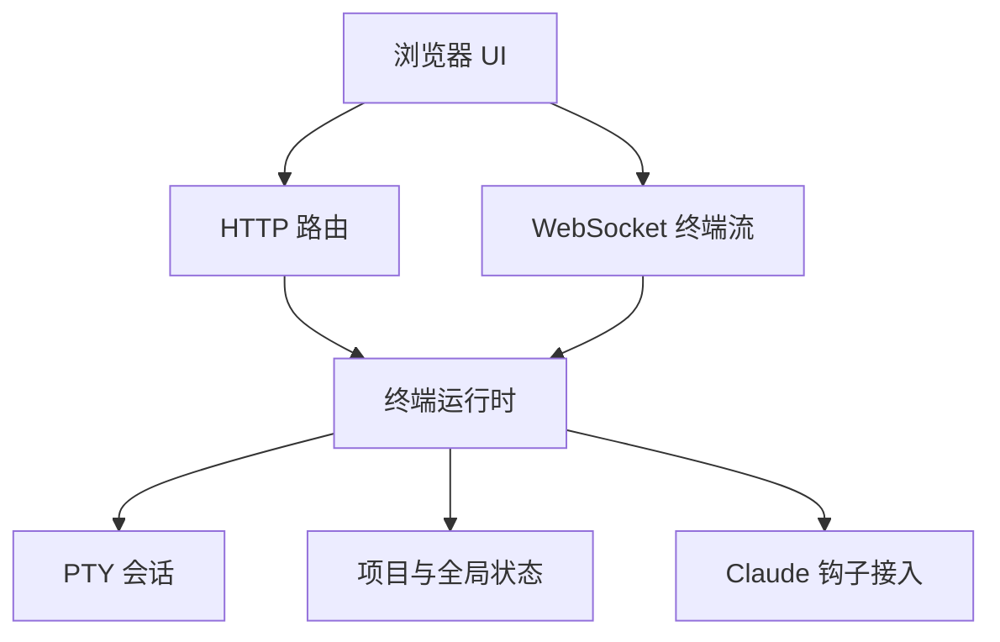

# 运行时与 API

Octogent 以本地 API 的形式运行，其上是本地 Web UI。

## 运行时结构

## 运行时职责

API 进程负责所有无法放进 markdown 的活动部件：

- 终端注册表的加载、迁移与持久化
- PTY 生命周期与回滚缓冲（scrollback）
- 终端 IO 与终端列表事件的 WebSocket 升级
- Claude 钩子的安装与接入
- 隔离终端的工作树创建与清理
- 转录捕获与对话导出
- 内存中的通道队列
- 对 `.octogent/tentacles/` 的 Deck 文件操作
- UI 状态持久化

## 传输模型

- HTTP 负责增删改查、快照、提示词解析、安装检查以及基于文件的操作
- `WS /api/terminals/:terminalId/ws` 把一个浏览器终端接到一个 PTY 会话上
- `WS /api/terminal-events/ws` 广播 terminal-created、terminal-updated、terminal-deleted 与状态变更事件
- 基于文件的状态是重启边界，涵盖终端记录、UI 状态、转录、Deck 元数据以及监控/缓存数据

终端 WebSocket 并不拥有 PTY。它们只是接到 API 进程所拥有的 PTY 会话上的客户端。浏览器刷新后，新的 WebSocket 可以在空闲宽限期内收到回滚缓冲；而 API 一旦重启，PTY 就不存在了。

## 安全默认值

- 默认绑定 `127.0.0.1`
- 默认强制回环 `Host` 与 `Origin` 校验
- 远程访问必须通过 `OCTOGENT_ALLOW_REMOTE_ACCESS=1` 显式开启

## 持久化模型

- 项目本地脚手架位于 `.octogent/`
- 运行时状态位于 `~/.octogent/projects/<project-id>/state/`
- 转录事件独立于 PTY 回滚缓冲持久化
- PTY 会话不会在 API 重启后存活
- 持久化为 `running` 的终端记录，启动时若没有存活的 Octogent 会话接管，会被对账为 `stale`

由于历史原因，终端注册表文件名叫 `tentacles.json`。当前的记录是终端而非触手。一条终端记录保存身份、触手 ID、可选的工作树 ID、父终端 ID、工作区模式、显示名、生命周期字段以及 UI 相关元数据。

Deck 元数据与触手 markdown 是分开的。`deck.json` 存放不应混入 `CONTEXT.md` 或 `todo.md` 的展示/状态细节。

## 终端生命周期

创建终端会先写入注册表记录。如果提供了初始提示词，运行时会立即启动 PTY 会话；否则 PTY 会等到 WebSocket 或直连监听器接入时再启动。

PTY 启动时，Octogent 会：

1. 根据终端的工作区模式解析工作目录
2. 通过 `node-pty` 启动用户的 shell
3. 注入配置好的代理引导命令
4. 视情况粘贴并提交初始提示词
5. 写入转录事件，并在内存中保留有上限的回滚缓冲
6. 向已接入的客户端广播状态更新

停止或杀死终端会拆除活动 PTY 并更新生命周期元数据。删除终端还会级联到子终端，并移除工作树类记录对应的工作树。

## 钩子机制

对于 Claude 支撑的终端，Octogent 会把钩子写入目标目录的 `.claude/settings.json`。这些钩子回调本地 API，提供仅靠终端输出无法可靠表达的状态转换。

钩子目前驱动以下机制：

- `UserPromptSubmit` 把终端标记为活跃，并可根据首条提示词为生成的终端自动命名
- `PreToolUse` 记录当前工具，并标记等待用户回答的状态
- `Notification` 标记权限等待与空闲提示
- `Stop` 把 Claude 转录数据解析为存储的对话，并释放空闲保活
- `Edit|Write` 的 `PostToolUse` 为代码洞察（code-intel）提供事件

通道投递同样依赖钩子。消息在内存中排队，当目标会话空闲时注入，包括在空闲或 stop 钩子事件之后。

## 主要 API 分组

- 终端与快照
- Deck 触手与待办操作
- 提示词
- 通道
- 代码洞察
- 钩子接入
- 用量与遥测
- 监控
- 对话

具体端点见 [API 参考](../reference/api.md)。

> 本文件是 [../../concepts/runtime-and-api.md](../../concepts/runtime-and-api.md) 的中文翻译版本。如有歧义，以英文原文为准。
